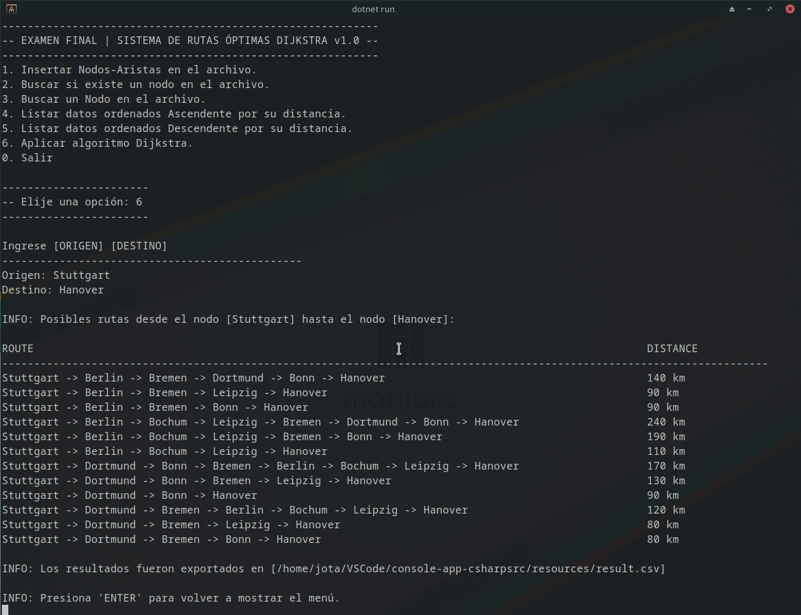

## Aplicación en consola Djkstra
Esta aplicación realiza un calculo optimo de la ruta mas corta de una lista de rutas que son 
leidas de un archivo que previamente fueron registradas, aunque tambien puedes registrar desde 
el menu de opciones. El programa hace uso principalmente del Algoritmo Dijkstra.
### Requisitos
Para poder ejecutar la aplicación debemos tener instalado las siguientes aplicaciones necesarias como minimo.  
- [VSCode](https://code.visualstudio.com/download) - Editor
- [NET 6.0](https://dotnet.microsoft.com/en-us/download/visual-studio-sdks) - SDK .NET 6.0
### Ejecución
Ubicate en la carpeta raiz.
```sh
dotnet run
```
### Fin
Listo ya puedes hacer uso de la aplicación.

